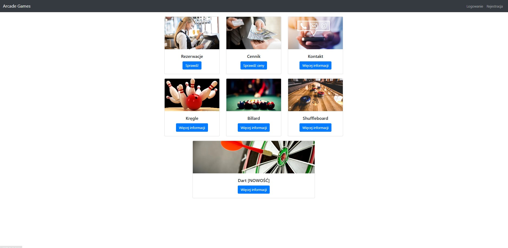

<h1 align="left">Project Description</h1>

The Arcade Games Reservation System is a web-based application designed to allow users to reserve arcade games such as billiards, bowling, darts, and shuffleboard. The system is integrated with a MySQL database and provides functionalities for user authentication, game availability checking, and reservation management. The project is developed using Flask (Python) for the backend and HTML, CSS, JavaScript for the frontend. The database ensures secure data storage and efficient retrieval of user reservations.

<h2 align="left">Features</h2>

- **User Authentication**
  - User registration with validation for email format and password strength.
  - Secure password hashing using bcrypt.
  - Login and session management using Flask sessions.

- **Game Browsing and Reservation**
  - Dynamic display of available arcade games.
  - Individual game pages with details on availability and rules.
  - A reservation system that prevents conflicts and ensures availability.

- **User Panel**
  - View and manage existing reservations.
  - Access contact details and opening hours.
  - Check the price list of available games.

- **Admin Panel**
  - Perform system tests to validate key functionalities.
  - Manage game availability and monitor user activity.

- **Security Features**
  - Password encryption for secure authentication.
  - Prevention of SQL Injection and CSRF attacks.
  - Logging of all user and admin activities.

- **Technology Stack**
  - **Backend:** Flask (Python)
  - **Database:** MySQL
  - **Frontend:** HTML, CSS, JavaScript
  - **Security:** bcrypt, Flask-WTF for form validation

<h2 align="left">Preview</h2>

